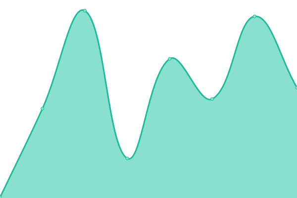

# [📈 Live Status](https://ast3risk-ops.github.io/lapsus-status): <!--live status--> **🟩 All systems operational**

This repository contains the open-source uptime monitor and status page for the [Lapsus Launcher](https://github.com/ManucrackYT/LapsusLauncher), powered by [Upptime](https://github.com/upptime/upptime).

With [Upptime](https://upptime.js.org), you can get your own unlimited and free uptime monitor and status page, powered entirely by a GitHub repository. We use [Issues](https://github.com/ast3risk-ops/lapsus-status/issues) as incident reports, [Actions](https://github.com/ast3risk-ops/lapsus-status/actions) as uptime monitors, and [Pages](https://ast3risk-ops.github.io/lapsus-status) for the status page.

<!--start: status pages-->
<!-- This summary is generated by Upptime (https://github.com/upptime/upptime) -->
<!-- Do not edit this manually, your changes will be overwritten -->
<!-- prettier-ignore -->
| URL | Status | History | Response Time | Uptime |
| --- | ------ | ------- | ------------- | ------ |
|  [Multiplayer Session Service (Mojang)](https://session.minecraft.net) | 🟩 Up | [multiplayer-session-service-mojang.yml](https://github.com/Ast3risk-ops/lapsus-status/commits/HEAD/history/multiplayer-session-service-mojang.yml) | 

 181ms
     
 | 

<a href="https://ast3risk-ops.github.io/lapsus-status/history/multiplayer-session-service-mojang">100.00%</a>
    

|  [Minecraft Skins (Mojang)](https://textures.minecraft.net) | 🟩 Up | [minecraft-skins-mojang.yml](https://github.com/Ast3risk-ops/lapsus-status/commits/HEAD/history/minecraft-skins-mojang.yml) | 

 176ms
     
 | 

<a href="https://ast3risk-ops.github.io/lapsus-status/history/minecraft-skins-mojang">100.00%</a>
    

|  [Legacy Mojang Accounts](https://account.mojang.com/login) | 🟩 Up | [legacy-mojang-accounts.yml](https://github.com/Ast3risk-ops/lapsus-status/commits/HEAD/history/legacy-mojang-accounts.yml) | 

 564ms
     
 | 

<a href="https://ast3risk-ops.github.io/lapsus-status/history/legacy-mojang-accounts">100.00%</a>
    

|  [Authentication Service (Xbox)](https://api.minecraftservices.com/authentication/login_with_xbox) | 🟩 Up | [authentication-service-xbox.yml](https://github.com/Ast3risk-ops/lapsus-status/commits/HEAD/history/authentication-service-xbox.yml) | 

 82ms
     
 | 

<a href="https://ast3risk-ops.github.io/lapsus-status/history/authentication-service-xbox">100.00%</a>
    

|  [Microsoft OAuth2 Gateway](https://login.microsoftonline.com/consumers/oauth2/v2.0/token) | 🟩 Up | [microsoft-o-auth2-gateway.yml](https://github.com/Ast3risk-ops/lapsus-status/commits/HEAD/history/microsoft-o-auth2-gateway.yml) | 

 120ms
     
 | 

<a href="https://ast3risk-ops.github.io/lapsus-status/history/microsoft-o-auth2-gateway">100.00%</a>
    

|  [Authentication Server (Xbox)](https://user.auth.xboxlive.com/user/authenticate) | 🟩 Up | [authentication-server-xbox.yml](https://github.com/Ast3risk-ops/lapsus-status/commits/HEAD/history/authentication-server-xbox.yml) | 

 190ms
     
 | 

<a href="https://ast3risk-ops.github.io/lapsus-status/history/authentication-server-xbox">100.00%</a>
    

|  [Gatekeeper (Xbox)](https://xsts.auth.xboxlive.com/xsts/authorize) | 🟩 Up | [gatekeeper-xbox.yml](https://github.com/Ast3risk-ops/lapsus-status/commits/HEAD/history/gatekeeper-xbox.yml) | 

 82ms
     
 | 

<a href="https://ast3risk-ops.github.io/lapsus-status/history/gatekeeper-xbox">100.00%</a>
    

|  [Minecraft API (Microsoft)](https://api.minecraftservices.com/authentication/login_with_xbox) | 🟩 Up | [minecraft-api-microsoft.yml](https://github.com/Ast3risk-ops/lapsus-status/commits/HEAD/history/minecraft-api-microsoft.yml) | 

 2ms
     
 | 

<a href="https://ast3risk-ops.github.io/lapsus-status/history/minecraft-api-microsoft">100.00%</a>
    

|  [Minecraft Profile Services (Microsoft)](https://api.minecraftservices.com/minecraft/profile) | 🟩 Up | [minecraft-profile-services-microsoft.yml](https://github.com/Ast3risk-ops/lapsus-status/commits/HEAD/history/minecraft-profile-services-microsoft.yml) | 

 85ms
     
 | 

<a href="https://ast3risk-ops.github.io/lapsus-status/history/minecraft-profile-services-microsoft">100.00%</a>
    

<!--end: status pages-->

[**Visit our status website →**](https://ast3risk-ops.github.io/lapsus-status)

## 📄 License

- Powered by: [Upptime](https://github.com/upptime/upptime)
- Code: [MIT](./LICENSE) © [Asterisk](https://asterisk.lol)
- Data in the `./history` directory: [Open Database License](https://opendatacommons.org/licenses/odbl/1-0/)
